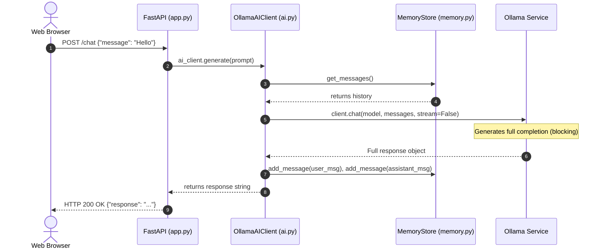

# Phase 2 Engineering Plan: Streaming Responses for EKKI-RE-AI

This document presents the detailed architectural analysis and implementation plan for Phase 2: **Streaming Responses** in the EKKI-RE-AI system.

---

## 1. Codebase Architecture & Key Files

The codebase is organized into a decoupled FastAPI backend, local memory store, system prompt manager, and web frontend:

- [backend/app.py](file:///c:/Users/kotti/EKKI-RE-AI/backend/app.py): Entry point for FastAPI application server. Configures CORS, defines Pydantic request/response schemas, and registers endpoints (`/health`, `/chat`).
- [backend/ai.py](file:///c:/Users/kotti/EKKI-RE-AI/backend/ai.py): Wraps Ollama python SDK (`ollama.Client`). Handles system prompt retrieval, context history formatting, memory commits, and LLM invocation via `generate()`.
- [backend/memory.py](file:///c:/Users/kotti/EKKI-RE-AI/backend/memory.py): Thread-safe `InMemoryMemoryStore` implementing sliding-window message queue with `ChatMessage` models and `RLock` synchronization.
- [backend/config.py](file:///c:/Users/kotti/EKKI-RE-AI/backend/config.py): Centralized configuration via Pydantic `BaseSettings` (Ollama host URL, model names, memory limits).
- [backend/prompts/system_prompt.py](file:///c:/Users/kotti/EKKI-RE-AI/backend/prompts/system_prompt.py): System prompt definition and loading logic.
- [frontend/script.js](file:///c:/Users/kotti/EKKI-RE-AI/frontend/script.js): Browser UI controller submitting POST requests to `/chat` and rendering message elements.

---

## 2. Current Request Flow (Phase 1 Synchronous Model)



### Detailed Breakdown:
1. **Request Ingestion**: The client sends a `POST` request to `/chat` containing a JSON payload `{ "message": "..." }`.
2. **Validation**: FastAPI parses the JSON body against `ChatRequest` (checking for non-empty trimmed strings).
3. **Execution**: FastAPI dispatches the synchronous `chat()` handler function to an `anyio` worker thread.
4. **Context Construction**: `OllamaAIClient.generate()` constructs the prompt payload:
   - Fetches global system prompt (`get_system_prompt()`).
   - Retrieves active conversation history from `InMemoryMemoryStore`.
   - Appends incoming active user message.
5. **Blocking Generation**: `ai_client._client.chat()` sends a synchronous HTTP request to Ollama (`http://localhost:11434/api/chat`). The backend thread blocks until Ollama finishes generating the *entire* response.
6. **Memory Commit**: Upon completion, both the user message and generated assistant text are appended to the thread-safe `InMemoryMemoryStore`.
7. **Response Delivery**: FastAPI wraps the text inside `ChatResponse(response=...)` and returns JSON HTTP 200 OK to the user.

---

## 3. Streaming Architecture Design (Phase 2)

```mermaid
sequenceDiagram
    autonumber
    actor User as Web Browser
    participant API as FastAPI (app.py)
    participant Client as OllamaAIClient (ai.py)
    participant Mem as MemoryStore (memory.py)
    participant Ollama as Ollama Service

    User->>API: POST /chat/stream {"message": "Hello"}
    API->>Client: ai_client.generate_stream(prompt)
    Client->>Mem: get_messages()
    Mem-->>Client: returns history
    Client->>Ollama: client.chat(model, messages, stream=True)
    API-->>User: HTTP 200 OK (headers: text/event-stream)
    
    loop Chunk Stream
        Ollama-->>Client: Yields chunk delta token
        Client-->>API: Yields SSE formatted frame (`data: {"content": "..."}\n\n`)
        API-->>User: Streams chunk frame over connection
    end

    Note over Client: Stream ends; commit accumulated response
    Client->>Mem: add_message(user_msg), add_message(assistant_msg)
    Client-->>API: Yields final done frame (`data: [DONE]\n\n`)
    API-->>User: Connection closed
```

### Architecture Specifications:

1. **Protocol Protocol / Serialization Format**:
   - **Server-Sent Events (SSE)** (`text/event-stream`).
   - Standard format per chunk: `data: {"content": "token_chunk"}\n\n`.
   - Completion marker: `data: [DONE]\n\n` or `{"type": "done"}`.
   - Error marker (mid-stream): `data: {"error": "error message details"}\n\n`.

2. **Ollama Streaming Mode**:
   - Invoke `self._client.chat(model=..., messages=..., stream=True)`.
   - Returns a Python generator yielding stream chunk objects/dicts: `chunk['message']['content']`.

3. **Streaming Memory Management**:
   - Initialize an in-memory accumulation buffer string (`accumulated_response = []`) inside `generate_stream()`.
   - As each token chunk arrives from Ollama, append chunk text to `accumulated_response` and yield the SSE data frame immediately.
   - **On Normal Completion**: Combine `accumulated_response`, create `ChatMessage` objects for user and assistant, and commit both to `InMemoryMemoryStore`.
   - **On Stream Disconnection/Error**: If the stream terminates prematurely, decide whether to commit the partially generated response or discard it safely without corrupting conversation memory state.

4. **Async vs Thread-pool Streaming**:
   - FastAPI `StreamingResponse` natively accepts synchronous generators or async generators.
   - Using `ollama.AsyncClient` with `async def generate_stream()` allows non-blocking asynchronous event-loop streaming, preventing worker thread pool exhaustion under concurrent client requests.

---

## 4. User Review Required

> [!IMPORTANT]
> **Streaming Protocol Choice**: We propose using standard Server-Sent Events (SSE - `text/event-stream`) formatted payloads.
> - SSE is natively supported by browsers (`fetch()` + `ReadableStream` or `EventSource`) and is the standard protocol used by OpenAI, Anthropic, and Vercel AI SDK.

> [!NOTE]
> **Endpoint Strategy**: We can either:
> 1. Add a dedicated endpoint `POST /chat/stream` alongside `POST /chat` (recommended for backwards compatibility).
> 2. Upgrade the existing `POST /chat` endpoint to support optional streaming via a `stream: bool` request flag.

---

## 5. Open Questions

1. **Endpoint Preference**: Do you prefer keeping the existing non-streaming `POST /chat` endpoint intact and adding `POST /chat/stream` for streaming, or unifying them into `POST /chat` with a `"stream": true` flag in the JSON body?
2. **Partial Memory Commit**: If a user cancels the HTTP connection mid-stream, should the backend save the partially generated response into memory history, or discard it? (Default recommendation: discard incomplete responses to avoid memory corruption).

---

## 6. Proposed Changes & Impacted Files

### Backend Components

#### [MODIFY] [ai.py](file:///c:/Users/kotti/EKKI-RE-AI/backend/ai.py)
- Introduce `generate_stream(prompt: str) -> Iterator[str]` (or `AsyncIterator[str]`).
- Implement Ollama `stream=True` iterator.
- Implement streaming accumulator logic for `memory_store` updates.
- Format chunks as valid SSE data strings: `data: {"content": "..."}\n\n`.

#### [MODIFY] [app.py](file:///c:/Users/kotti/EKKI-RE-AI/backend/app.py)
- Import `StreamingResponse` from `fastapi.responses`.
- Add streaming chat endpoint (`POST /chat/stream` or updated `/chat`).
- Add appropriate headers (`Cache-Control: no-cache`, `Connection: keep-alive`, `X-Accel-Buffering: no` to prevent proxy buffering).

#### [MODIFY] [config.py](file:///c:/Users/kotti/EKKI-RE-AI/backend/config.py)
- Add optional streaming configuration settings (e.g., `SSE_PING_INTERVAL`, timeout defaults) if required.

---

### Frontend Components

#### [MODIFY] [script.js](file:///c:/Users/kotti/EKKI-RE-AI/frontend/script.js)
- Update `fetchAiResponse` to handle streaming responses using `fetch()` and `response.body.getReader()`.
- Use `TextDecoder` to parse incoming SSE chunks.
- Progressively append tokens to the UI message bubble in real-time, scrolling dynamically.

---

## 7. Advantages & Trade-Offs

### Advantages:
- **Instant Responsiveness**: Reduces user-perceived latency (Time-to-First-Token drops from seconds to milliseconds).
- **Superior UX**: Gives users visual feedback that the model is generating text immediately.
- **Resource Efficiency**: Clients can abort generation early if they realize the response isn't what they wanted.

### Trade-Offs & Engineering Considerations:
- **HTTP Header Timing**: HTTP status headers (200 OK) are sent at the start of the stream. Errors occurring mid-way through generation cannot change the HTTP status code to 4xx or 5xx; they must be emitted as in-stream error events.
- **Memory Consistency**: Memory store updates must be deferred until stream completion, requiring state tracking across stream lifecycles.
- **Connection Overhead**: Long-lived HTTP streaming connections require proper keep-alive handling and header configurations to bypass reverse proxy buffering.

---

## 8. Verification Plan

### Automated Tests
- Unit test for `generate_stream()` mocking Ollama streaming generator.
- Integration test for `POST /chat/stream` using FastAPI `TestClient` to verify chunked SSE response streams.

### Manual Verification
- Test real-time streaming in the browser UI.
- Verify live typing effect and smooth scrolling during long response generation.
- Test connection drop / cancel scenario to ensure memory store remains consistent.
